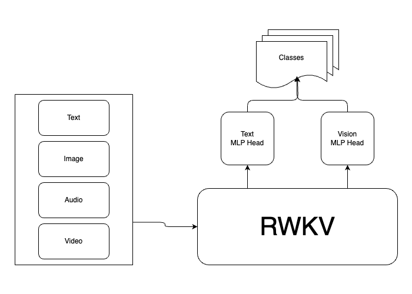

# Content Moderation with RWKV Architecture & FasterViT

## Introduction

This repository hosts the implementation of a cutting-edge content moderation solution, leveraging the RWKV architecture tailored to analyze and moderate content within the BlueSky dataset efficiently. By integrating the RWKV sequence processing mechanisms, our model represents a novel approach in the realm of content moderation, emphasizing speed, accuracy, and scalability.

### Authors:

- Umut YILDIRIM

## Overview

The core of this project lies in its innovative use of the RWKV (Recurrent Weighted Key-Value) architecture, a derivative concept inspired by the Vision Transformer (ViT) architecture but optimized for sequential data processing. Our model exemplifies the potential of RWKV in understanding and moderating content by processing sequences with remarkable efficiency.

## Architecture

Our model architecture is designed around the RWKV framework, focusing on leveraging its unique sequence processing capabilities. Unlike traditional approaches that might integrate architectures like ResNet for pre-processing, our model stands out by relying entirely on RWKV mechanisms, showcasing its standalone competency in handling complex content moderation tasks.

TODO: Add better architecture image

### Model Comparisons:

We benchmark our RWKV-based model against prevailing State-of-the-Art (SOTA) solutions and an alternative transformer-based approach. Through comprehensive ablation studies, we highlight the advantages and efficiency of the RWKV architecture in content moderation, presenting detailed performance metrics and comparative analysis.

## Repository Structure

The repository structure is organized as follows:

- **`data/`**: Hosts the dataset used for training and evaluation.
- **`utils.py`**: Implements a custom learning rate scheduler for optimized training.
- **`models/FaceRWKV`**: Contains the RWKV-based model specifically designed for facial expression recognition within content.
- **`models/RWKV`**: Incorporates the RWKV architecture's core implementation, sourced from the official RWKV GitHub repository.
- **`models/Preprocessing`**: Offers preprocessing utilities, optionally incorporating ResNet for image sequence preparation.
- **`config/`**: Stores YAML configuration files for customizable model training setups.
- **`Dataset/`**: Details on the custom dataset structure and preparation steps. **TODO:** Expand with more information.
- **`train.py`**: The main script for initiating model training. Usage is straightforward: `python train.py --config <path_to_config_file>`.

## Getting Started

To kickstart your journey with this content moderation framework, follow these steps:

1. **Repository Cloning**: Clone this repository to your local machine or development environment.
2. **Dependency Installation**: Install all necessary dependencies listed in `requirements.txt` to ensure compatibility and smooth operation.
3. **Dataset Preparation**: Either utilize the provided dataset or configure your dataset path within the `config/config.yml` file for personalized training.
4. **Training Configuration**: Adjust the training parameters as needed in `config/config.yml` to match your specific requirements and objectives.
5. **Model Training**: Launch the training process by executing the command `python train.py --config config/config.yml`.

## Experimental Results

- **TODO:** This section will be populated with detailed performance metrics, visualizations, and insights derived from the model's evaluation, showcasing its effectiveness in content moderation tasks.

## Citation and Acknowledgements

If you found this repository useful, please consider citing:

- **TODO:** Citation details and acknowledgments to contributors, datasets, and foundational research will be provided here to facilitate academic and practical applications of our work.
